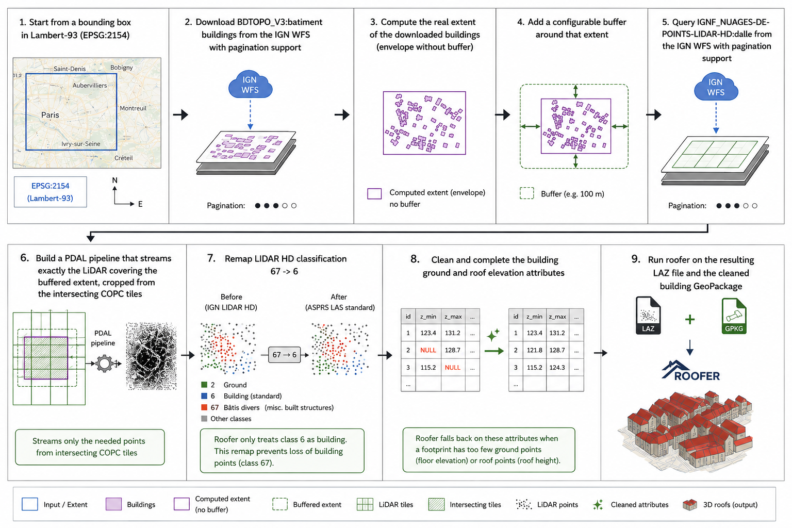

# Using roofer with IGNF datasets

**Language:** [🇬🇧 English](README.md) · [🇫🇷 Français](README.fr.md)

This repository is a minimal, Docker-first example showing how to use [roofer](https://github.com/3DBAG/roofer) with [IGNF](https://github.com/IGNF) datasets ([BD TOPO](https://cartes.gouv.fr/rechercher-une-donnee/dataset/IGNF_BD-TOPO) and [LIDAR HD](https://cartes.gouv.fr/rechercher-une-donnee/dataset/IGNF_NUAGES-DE-POINTS-LIDAR-HD)) to produce 3D LOD2.2 buildings. This is a starting point for experimenting.

`roofer` is the [3DBAG](https://3dbag.nl/en/viewer) reconstruction tool that turns building footprints and point clouds into 3D building models. The wider [3dbag-pipeline](https://github.com/3DBAG/3dbag-pipeline) project shows how these tools are used in larger production workflows. This repository focuses on a much smaller example: starting from a Lambert-93 bounding box, downloading the required IGNF data from its [Géoplateforme](https://www.ign.fr/geoplateforme), and preparing the inputs needed to run `roofer` and produce 3D buildings.

The workflow of this project is:

1. Start from a bounding box in Lambert-93 (`EPSG:2154`)
2. Download `BDTOPO_V3:batiment` buildings from the [IGN WFS](https://cartes.gouv.fr/aide/fr/guides-utilisateur/utiliser-les-services-de-la-geoplateforme/diffusion/wfs/) with pagination support
3. Compute the real extent of the downloaded buildings
4. Add a configurable buffer around that extent
5. Query `IGNF_NUAGES-DE-POINTS-LIDAR-HD:dalle` from the [IGN WFS](https://cartes.gouv.fr/aide/fr/guides-utilisateur/utiliser-les-services-de-la-geoplateforme/diffusion/wfs/) with pagination support
6. Build a PDAL pipeline that streams exactly the LiDAR covering the buffered extent, cropped from the intersecting COPC tiles
7. Remap LIDAR HD classification `67 -> 6`, because `roofer` follows the ASPRS LAS standard and only treats class `6` as *building*, whereas IGN LIDAR HD also places building points in its non-standard class `67` (*DIvers - bâtis*, i.e. miscellaneous built structures); without this remap those points would be invisible to `roofer` and lost for roof reconstruction
8. Clean and complete the building ground and roof elevation attributes, which `roofer` falls back on when a footprint has too few ground points (for the floor elevation) or roof points (for the roof height)
9. Run `roofer` on the resulting LAZ file and the cleaned building GeoPackage


<p align="center">
  <a href="docs/imgs/workflow.png" target="_blank"></a>
</p>

The goal is to keep the code and user setup as simple as possible. The host only needs [Docker](https://www.docker.com/).

## Scope

- Linux or macOS host (the workflow itself always runs inside a Linux container)
- Docker only
- Input bbox must be in `EPSG:2154` for now
- One bbox at a time
- No native local installation path

## Prerequisites

- Docker installed and available in `PATH` (Docker Engine on Linux, Docker Desktop on macOS)
- A POSIX `bash` to run `run.sh` (macOS ships bash 3.2, which is sufficient)
- Network access to:
  - `https://data.geopf.fr`
  - the COPC storage URLs returned by the LiDAR tiles WFS
  - Docker Hub to pull `3dgi/3dbag-pipeline-tools:2026.06.24`

## Quick start

Example running the workflow with a Lambert-93 bounding box centered on [Les Espaces d'Abraxas in Noisy-le-Grand](https://cartes.gouv.fr/explorer-les-cartes?c=2.542793,48.839983&z=18&l=ORTHOIMAGERY.ORTHOPHOTOS$GEOPORTAIL:OGC:WMTS(1;1;1;0)&w=&permalink=yes):

```bash
./run.sh --bbox 666201 6859851 666701 6860351
```

With a custom buffer (default is `10` meters) and output root directory (default is `./output`):

```bash
./run.sh --bbox 666201 6859851 666701 6860351 --buffer 15 --out ./example-output
```

The generated `CityJSONSeq` result files in `output/run-*/roofer_output/` or `example-output/run-*/roofer_output/` can be opened directly in [ninja.cityjson.org](https://ninja.cityjson.org/).

<p align="center">
  
</p>
<p align="center"><em>Open or drag and drop the generated CityJSONSeq output directly in ninja.cityjson.org.</em></p>

<p align="center">
  
</p>
<p align="center"><em>Inspect the reconstructed buildings interactively in the viewer.</em></p>

<details>
<summary><strong>Corporate proxy support</strong></summary>

For most users, there is nothing to configure.

If you run this workflow from the IGNF network or other networks behind corporate proxy, export your proxy variables in the shell before calling `run.sh` if they are not already defined. The `run.sh` script forwards them to Docker.

Example:

```bash
export HTTPS_PROXY=http://proxy.example.com:8080
export HTTP_PROXY=http://proxy.example.com:8080
export NO_PROXY=localhost,127.0.0.1

./run.sh --bbox 666201 6859851 666701 6860351
```

</details>

## Outputs

The workflow writes all intermediate artifacts in a dedicated run directory under the output root (`--out`) so the process stays easy to inspect and debug. Each run directory is named `run-YYYYMMDD-HHMMSS`. Existing run directories with previous artifacts are refused by default; pass `--clean` to clear marked run directories before running.

Expected files inside each run directory:

- `buildings.gpkg`: building footprints downloaded from `BDTOPO_V3:batiment` in `EPSG:2154` and normalized to `MULTIPOLYGON`
- `building_bbox.json`: the real building extent computed from the downloaded building layer
- `buffered_bbox.json`: the building extent after applying the user-defined buffer
- `lidar_tiles.gpkg`: LiDAR tile features returned by `IGNF_NUAGES-DE-POINTS-LIDAR-HD:dalle` for the buffered bbox
- `pdal_pipeline.json`: the generated PDAL pipeline
- `lidar_subset.laz`: the cropped LiDAR subset written by PDAL for the buffered bbox, with class `67` remapped to `6`
- `buildings_cleaned.gpkg`: building footprints after attribute cleaning and completion, used as the polygon source for `roofer`
- `roofer_output/`: the final [CityJSONSeq](https://www.cityjson.org/cityjsonseq/) output produced by `roofer`
- `.roofer-run-output`: marker used by `run.sh` to identify run directories it is allowed to clean with `--clean`

## What the scripts do

### `run.sh`

Host-side entrypoint that:

- validates the CLI arguments
- creates the output root and per-run output directory on the host
- marks run directories with `.roofer-run-output`
- refuses non-empty unmarked run directories, even when `--clean` is passed
- refuses marked run directories with existing run artifacts unless `--clean` is passed
- passes proxy-related environment variables to Docker
- launches the container workflow

CLI:

```text
./run.sh --bbox xmin ymin xmax ymax [--buffer meters] [--out path] [--jobs n] [--clean]
```

Arguments:

- `--bbox xmin ymin xmax ymax` required, input extent in `EPSG:2154`
- `--buffer` optional, between `0` and `500` meters, defaults to `10` meters
- `--out` optional, defaults to `./output`; this is the output root that contains run directories
- `--jobs` optional, forwarded to `roofer -j`, defaults to `nproc - 1` with a minimum of `1`
- `--clean` optional, clears marked run directories under `--out`

### `scripts/run_workflow.sh`

Container-side workflow that:

- checks that `ogr2ogr`, `ogrinfo`, `pdal`, `roofer`, `python3`, `awk`, and `sed` are present in the runtime image
- downloads buildings from `BDTOPO_V3:batiment`
- computes the real building extent
- buffers that extent
- downloads LiDAR tiles footprints from `IGNF_NUAGES-DE-POINTS-LIDAR-HD:dalle`
- reads COPC URLs from the tile `url` attribute
- generates `pdal_pipeline.json` to extract the necessary piece of building for reconstruction
- runs `pdal pipeline`
- cleans and completes the building attributes with `set_building_attributes.sh` (requires `sqlite3`)
- runs `roofer`

### `scripts/build_pdal_pipeline.py`

Small Python helper that:

- reads the local LiDAR tile footprints dataset with `ogrinfo -json`
- reads COPC URLs from the schema-defined `url` property
- generates a PDAL pipeline with one `readers.copc` per tile

CLI:

```text
python3 scripts/build_pdal_pipeline.py \
  --tiles lidar_tiles.gpkg \
  --layer lidar_tiles \
  --bbox xmin ymin xmax ymax \
  --output-pipeline pdal_pipeline.json \
  --laz-output lidar_subset.laz
```

Arguments:

- `--tiles`: path to the local LiDAR tile footprint dataset, typically the generated `lidar_tiles.gpkg`
- `--layer`: name of the LiDAR tile footprint layer to read inside `--tiles` (e.g. `lidar_tiles`)
- `--bbox`: buffered extraction bbox in `EPSG:2154`, used as the PDAL `bounds` on each `readers.copc`
- `--output-pipeline`: path of the generated `pdal_pipeline.json`
- `--laz-output`: path of the cropped LAZ file written by the generated PDAL pipeline

### `scripts/set_building_attributes.sh`

Post-processes a building GeoPackage to clean and complete the ground and roof elevation attributes that `roofer` falls back on when a footprint has too few ground points (for the floor elevation) or roof points (for the roof height).

The script:

- removes features with NULL geometries
- fills missing minimum ground elevation from maximum ground elevation
- fills missing maximum ground elevation from minimum ground elevation
- fills missing minimum roof elevation from maximum roof elevation
- fills missing maximum roof elevation from minimum roof elevation
- computes missing building height using:
  `maximum roof elevation - minimum ground elevation`
- reconstructs missing roof elevations using:
  `ground elevation + building height`
- reconstructs missing ground elevations using:
  `roof elevation - building height`

CLI:

```text
bash scripts/set_building_attributes.sh \
  --input buildings.gpkg \
  --output buildings_cleaned.gpkg \
  --layer buildings \
  --ground-min-field altitude_minimale_sol \
  --ground-max-field altitude_maximale_sol \
  --roof-min-field altitude_minimale_toit \
  --roof-max-field altitude_maximale_toit \
  --height-field hauteur \
  --verbose 1
```

Arguments:

- `--input`: input building GeoPackage (read-only)
- `--output`: output GeoPackage created by the script
- `--layer`: building layer name inside the GeoPackage (default: `buildings`)
- `--ground-min-field`: field name for `minimal ground altitude`  (default: `altitude_minimale_sol`)
- `--ground-max-field`: field name for `maximal ground altitude`  (default: `altitude_maximale_sol`)
- `--roof-min-field`: field name for `minimal roof altitude`  (default: `altitude_minimale_toit`)
- `--roof-max-field`: field name for `maximal roof altitude`  (default: `altitude_maximale_toit`)
- `--height-field`: field name for `building height`  (default: `hauteur`)
- `--verbose`: verbosity level:
    - `0`: quiet mode
    - `1`: main processing steps and summary
    - `2`: detailed SQL diagnostics and per-step statistics


## Notes

- The runtime image is `3dgi/3dbag-pipeline-tools:2026.06.24`.
- The tool binaries in that image live under `/opt/3dbag-pipeline/tools/bin`, so the workflow exports that path explicitly before running GDAL, PDAL, and roofer.
- The building download uses the GDAL WFS driver through `ogr2ogr`.
- `roofer` treats the input polygons purely as 2D footprints (*roofprints*) and ignores any `Z` present in their geometry. All elevations are derived from the LiDAR point cloud, with the `altitude_*` attributes used only as fallbacks (see step 8). The building download therefore flattens geometries to 2D (`ogr2ogr -dim 2`), which is lossless for this workflow since the polygon `Z` would be discarded by `roofer` anyway.
- The implementation relies on GDAL paging support and does not implement any custom WFS paging code.
- The LiDAR extraction keeps the streamed crop on each `readers.copc` entry. It does not crop full tiles after download.
- The only LiDAR-specific transformation in this example is the class remapping `67 -> 6`, which aligns IGN's *bâtis divers* class with the ASPRS class `6` that `roofer` expects for buildings (see step 7).
- The final deliverable in this minimal workflow is the native `CityJSONSeq` output from `roofer`.
- Bounding box size directly drives runtime and reliability. A larger bbox means more buildings and more LiDAR tiles, all fetched through paged WFS requests: every extra page is another network round-trip that can time out or be cut short server-side, so very large areas are both slower and more likely to fail mid-download. The bbox is intentionally not capped in code, since the right size depends on your machine, network, and patience. **For large areas, prefer splitting the work into several smaller runs rather than issuing a single very large request.** The `--buffer` is a secondary expansion applied automatically around the building extent, so it is capped at `500` meters to guard against accidental runaway downloads.

## References

- IGN LIDAR HD product page: <https://cartes.gouv.fr/rechercher-une-donnee/dataset/IGNF_NUAGES-DE-POINTS-LIDAR-HD>
- IGN LIDAR HD content descriptor (classification nomenclature, incl. class `67`): <https://geoservices.ign.fr/sites/default/files/2024-09/DC_LiDAR_HD_1-0.pdf>
- IGN BDTOPO product page: <https://cartes.gouv.fr/rechercher-une-donnee/dataset/IGNF_BD-TOPO>
- IGN BDTOPO content descriptor: <https://data.geopf.fr/annexes/ressources/documentation/DC_BDTOPO_3-5.pdf>
- IGN WFS service: <https://cartes.gouv.fr/aide/fr/guides-utilisateur/utiliser-les-services-de-la-geoplateforme/diffusion/wfs/>
- Roofer getting started: <https://innovation.3dbag.nl/roofer/getting_started.html>
- Roofer CLI docs: <https://innovation.3dbag.nl/roofer/cli_application.html>
- Roofer input requirements: <https://innovation.3dbag.nl/roofer/data_requirements.html>
- PDAL `readers.copc`: <https://pdal.io/en/2.8.4/stages/readers.copc.html>
- PDAL `filters.assign`: <https://pdal.io/en/2.8.4/stages/filters.assign.html>
