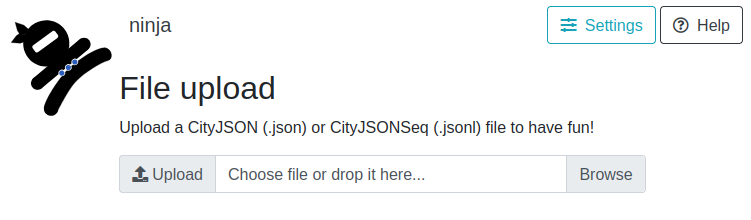
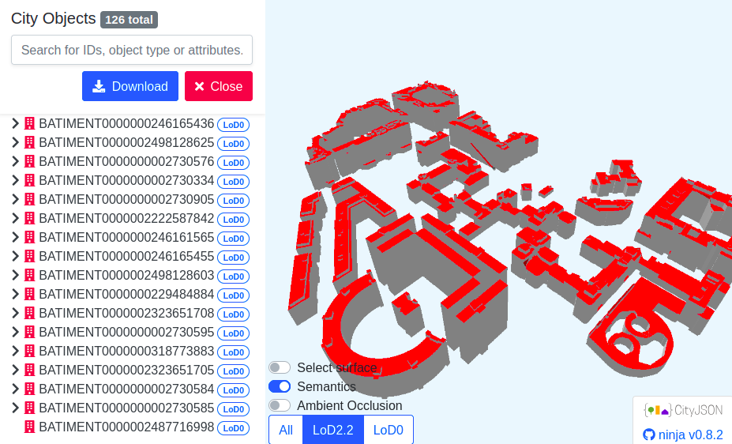

# Using roofer with IGNF datasets

This repository is a minimal, Docker-first example showing how to use [roofer](https://github.com/3DBAG/roofer) with IGN datasets ([BDTOPO](https://cartes.gouv.fr/rechercher-une-donnee/dataset/IGNF_BD-TOPO) and [LIDAR HD](https://cartes.gouv.fr/rechercher-une-donnee/dataset/IGNF_NUAGES-DE-POINTS-LIDAR-HD)) to produce 3d buildings. This is a starting point for experimenting.

`roofer` is the [3DBAG](https://3dbag.nl/en/viewer) reconstruction tool that turns building footprints and point clouds into 3D building models. The wider [3dbag-pipeline](https://github.com/3DBAG/3dbag-pipeline) project shows how these tools are used in larger production workflows. This repository focuses on a much smaller example: starting from a Lambert-93 bounding box, downloading the required IGNF data from its [Geoplateforme](https://www.ign.fr/geoplateforme), and preparing the inputs needed to run `roofer` and produce 3D buildings.

The workflow of this project is:

1. Start from a bounding box in Lambert-93 (`EPSG:2154`)
2. Download `BDTOPO_V3:batiment` buildings from the [IGN WFS](https://cartes.gouv.fr/aide/fr/guides-utilisateur/utiliser-les-services-de-la-geoplateforme/diffusion/wfs/)
3. Compute the real extent of the downloaded buildings
4. Add a configurable buffer around that extent
5. Query `IGNF_NUAGES-DE-POINTS-LIDAR-HD:dalle` from the [IGN WFS](https://cartes.gouv.fr/aide/fr/guides-utilisateur/utiliser-les-services-de-la-geoplateforme/diffusion/wfs/)
6. Build a PDAL pipeline that streams the intersecting COPC tiles
7. Remap LIDAR HD classification `67 -> 6`
8. Run `roofer` on the resulting LAZ file and building GeoPackage

The goal is to keep the code and user setup as simple as possible. The host only needs [Docker](https://www.docker.com/).

## Scope

- Linux only
- Docker only
- Input bbox must be in `EPSG:2154`
- One bbox at a time
- No native local installation path

## Prerequisites

- Docker installed and available in `PATH`
- Network access to:
  - `https://data.geopf.fr`
  - the COPC storage URLs returned by the LiDAR tile WFS
  - Docker Hub to pull `3dgi/3dbag-pipeline-tools:2026.04.01`

## Quick start

Run the workflow with a Lambert-93 bounding box centered on Les Espaces d'Abraxas in Noisy-le-Grand:

```bash
./run.sh --bbox 666201 6859851 666701 6860351
```

Add a custom buffer and output directory:

```bash
./run.sh --bbox 666201 6859851 666701 6860351 --buffer 15 --out ./example-output
```

The generated `CityJSONSeq` result files in `output/roofer_output/` or `example-output/roofer_output/` can be opened directly in [ninja.cityjson.org](https://ninja.cityjson.org/).

<p align="center">
  
</p>
<p align="center"><em>Open or drag and drop the generated CityJSONSeq output directly in ninja.cityjson.org.</em></p>

<p align="center">
  
</p>
<p align="center"><em>Inspect the reconstructed buildings interactively in the viewer.</em></p>

<details>
<summary><strong>Proxy support</strong></summary>

For most users, there is nothing to configure.

If you run this workflow from the IGNF network, export your proxy variables in the shell before calling `run.sh`. The script forwards them to Docker.

Example:

```bash
export HTTPS_PROXY=http://proxy.example.com:8080
export HTTP_PROXY=http://proxy.example.com:8080
export NO_PROXY=localhost,127.0.0.1

./run.sh --bbox 666201 6859851 666701 6860351
```

</details>

## Outputs

The workflow clears the output directory at the start of each run, then writes all intermediate artifacts there so the process stays easy to inspect and debug.

Expected files:

- `buildings.gpkg`: building footprints downloaded from `BDTOPO_V3:batiment`, reprojected to `EPSG:2154` and normalized to `MULTIPOLYGON`
- `building_bbox.json`: the real extent computed from the downloaded building layer
- `buffered_bbox.json`: the building extent after applying the user-defined buffer
- `lidar_tiles.gpkg`: LiDAR tile features returned by `IGNF_NUAGES-DE-POINTS-LIDAR-HD:dalle` for the buffered bbox
- `pdal_pipeline.json`: the generated PDAL pipeline with one `readers.copc` per selected tile
- `lidar_subset.laz`: the cropped LiDAR subset written by PDAL for the buffered bbox, with class `67` remapped to `6`
- `roofer_output/`: the final [CityJSONSeq](https://www.cityjson.org/cityjsonseq/) output produced by `roofer`

## What the scripts do

### `run.sh`

Host-side entrypoint that:

- validates the CLI arguments
- creates the output directory on the host
- passes proxy-related environment variables to Docker
- launches the container workflow

### `scripts/run_workflow.sh`

Container-side workflow that:

- clears the mounted output directory contents
- checks that `ogr2ogr`, `ogrinfo`, `pdal`, and `roofer` are present in the runtime image
- downloads buildings from `BDTOPO_V3:batiment`
- computes the real building extent
- buffers that extent
- downloads LiDAR tiles footprints from `IGNF_NUAGES-DE-POINTS-LIDAR-HD:dalle`
- reads COPC URLs from the tile `url` attribute
- generates `pdal_pipeline.json` to extract the necessary piece of building for reconstruction
- runs `pdal pipeline`
- runs `roofer`

### `scripts/set_building_attributes.sh`

Post-processes a building GeoPackage to clean and complete the attributes required by `roofer` as fallback altitudes if the LAZ doesn't fully cover the building.

The script:

- removes features with NULL geometries
- fills missing minimum ground elevation from maximum ground elevation
- fills missing maximum ground elevation from minimum ground elevation
- fills missing minimum roof elevation from maximum roof elevation
- fills missing maximum roof elevation from minimum roof elevation
- computes missing building height using:
  `maximum roof elevation - minimum ground elevation`
- reconstructs missing roof elevations using:
  `ground elevation + building height`
- reconstructs missing ground elevations using:
  `roof elevation - building height`

CLI:

```text
bash scripts/set_building_attributes.sh \
  --input buildings.gpkg \
  --output buildings_cleaned.gpkg \
  --layer buildings \
  --ground-min-field altitude_minimale_sol \
  --ground-max-field altitude_maximale_sol \
  --roof-min-field altitude_minimale_toit \
  --roof-max-field altitude_maximale_toit \
  --height-field hauteur \
  --verbose 1

Arguments:

- `--input`: input building GeoPackage (read-only)
- `--output`: output GeoPackage created by the script
- `--layer`: building layer name inside the GeoPackage (default: `BUILDINGS`)
- `--ground-min-field`: field name for `minimal ground altitude`  (default: `altitude_minimale_sol`)
- `--ground-max-field`: field name for `maximal ground altitude`  (default: `altitude_maximale_sol`)
- `--roof-min-field`: field name for `minimal roof altitude`  (default: `altitude_minimale_toit`)
- `--roof-max-field`: field name for `maximal roof altitude`  (default: `altitude_maximale_toit`)
- `--height-field`: field name for `building height`  (default: `hauteur`)
- `--verbose`: verbosity level:
    - `0`: quiet mode
    - `1`: main processing steps and summary
    - `2`: detailed SQL diagnostics and per-step statistics


### `scripts/build_pdal_pipeline.py`

Small Python helper that:

- reads the local LiDAR tile footprints dataset with `ogrinfo -json`
- reads COPC URLs from the schema-defined `url` property
- generates a PDAL pipeline with one `readers.copc` per tile

CLI:

```text
python3 scripts/build_pdal_pipeline.py \
  --tiles lidar_tiles.gpkg \
  --bbox xmin ymin xmax ymax \
  --output-pipeline pdal_pipeline.json \
  --laz-output lidar_subset.laz
```

Arguments:

- `--tiles`: path to the local LiDAR tile footprint dataset, typically the generated `lidar_tiles.gpkg`
- `--bbox`: buffered extraction bbox in `EPSG:2154`, used as the PDAL `bounds` on each `readers.copc`
- `--output-pipeline`: path of the generated `pdal_pipeline.json`
- `--laz-output`: path of the cropped LAZ file written by the generated PDAL pipeline

## CLI

```text
./run.sh --bbox xmin ymin xmax ymax [--buffer meters] [--out path] [--jobs n]
```

Arguments:

- `--bbox xmin ymin xmax ymax` required, input extent in `EPSG:2154`
- `--buffer` optional, defaults to `10` meters
- `--out` optional, defaults to `./output`; its contents are cleared on each run
- `--jobs` optional, forwarded to `roofer -j`, defaults to `nproc - 1` with a minimum of `0`

## Notes

- The runtime image is `3dgi/3dbag-pipeline-tools:2026.04.01`.
- The tool binaries in that image live under `/opt/3dbag-pipeline/tools/bin`, so the workflow exports that path explicitly before running GDAL, PDAL, and roofer.
- The building download uses the GDAL WFS driver through `ogr2ogr`.
- The implementation relies on GDAL paging support and does not implement any custom WFS paging code.
- The LiDAR extraction keeps the streamed crop on each `readers.copc` entry. It does not crop full tiles after download.
- The only LiDAR-specific transformation in this example is the class remapping `67 -> 6`.
- The final deliverable in this minimal workflow is the native `CityJSONSeq` output from `roofer`.

## References

- Roofer getting started: <https://innovation.3dbag.nl/roofer/getting_started.html>
- Roofer CLI docs: <https://innovation.3dbag.nl/roofer/cli_application.html>
- Roofer input requirements: <https://innovation.3dbag.nl/roofer/data_requirements.html>
- PDAL `readers.copc`: <https://pdal.io/en/2.8.4/stages/readers.copc.html>
- PDAL `filters.assign`: <https://pdal.io/en/2.8.4/stages/filters.assign.html>
- IGN LIDAR HD product page: <https://cartes.gouv.fr/rechercher-une-donnee/dataset/IGNF_NUAGES-DE-POINTS-LIDAR-HD>
- IGN BDTOPO product page: <https://cartes.gouv.fr/rechercher-une-donnee/dataset/IGNF_BD-TOPO>
- IGN WFS service: <https://cartes.gouv.fr/aide/fr/guides-utilisateur/utiliser-les-services-de-la-geoplateforme/diffusion/wfs/>
